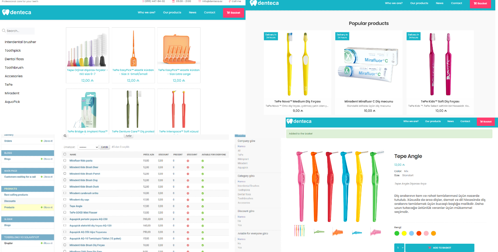

E-commerse Dental App
> django-ecommerse-app


 ## [Demo](https://ecommerse.denteca.az/)
 
 


## Tools


Dental e-commerce app built using the Django framework It allows users to browse and purchase dental products online, and the app provides a powerful interface for administrators to manage various aspects of the application, including products, orders, blogs, etc. It offers an easy-to-use dashboard with intuitive controls for performing administrative tasks efficiently.


### Admin panel

[https://ecommerse.denteca.az/admin](https://ecommerse.denteca.az/admin)

Several activities are restricted for the presentation.

> username: admin
> 
> password: djangoadmin


## Requirements

python 3.7.7

django 4.2.1

django-mailjet

pillow

ckeditor

## Development setup

```sh
pip install -r requirements.txt
python manage.py makemigrations
python manage.py migrate
python manage.py runserver
```

## Meta

 Nijat Gurbanov

- Github: [github.com/NikoFX](https://github.com/NikoFX)
- Twitter: [Nijat Gurbanov](https://twitter.com/)
- Linkedin: [linkedin.com/in/nijat-gurbanov-dev](https://www.linkedin.com/in/nijat-gurbanov-dev/)

## Contributing

1. Fork it
2. Create your feature branch (`git checkout -b feature/fooBar`)
3. Commit your changes (`git commit -am 'Add some fooBar'`)
4. Push to the branch (`git push origin feature/fooBar`)
5. Create a new Pull Request
